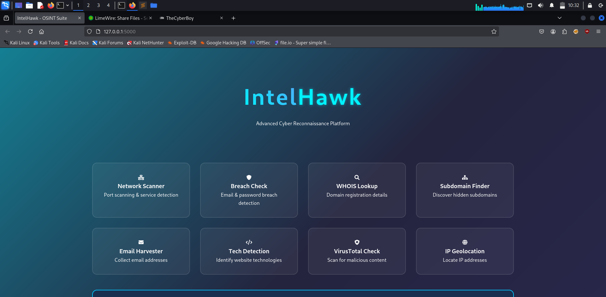

# 🦅 IntelHawk

**Advanced OSINT Reconnaissance Web Application**  
*A modular, beginner-friendly, and powerful toolkit for cybersecurity professionals, bug bounty hunters, and researchers.*

---

 

---

## 🚀 Features

### 🧠 Core OSINT Modules
- 🔎 **Subdomain Enumeration** (via Sublist3r)
- 🌐 **Network Scanning** (via Nmap)
- 📄 **WHOIS Lookup** (via python-whois)
- 📧 **Email Harvesting** (via theHarvester)
- 🧠 **Technology Detection** (via WhatWeb)
- 📍 **IP Geolocation** (via IP-API)
- 🔐 **Breach Check** (via Breach-Checker)
- 🧬 **Malware Scan** (via VirusTotal API)

### 🎨 UI/UX Highlights
- Cyberpunk-inspired design with neon accents
- Responsive card grid for modules
- Real-time task feedback
- Export reports as **PDF** or **JSON**
- Smooth transitions & hover effects

---

## ⚙️ Installation

### 🧩 Prerequisites
Make sure you have the following tools installed/Or you can download with setup.py file:

```bash
sudo apt update
sudo apt install -y nmap whatweb theharvester
````

You also need:

* **Python 3.8+**
* **pip**
* An internet connection

---

### 🧱 Setup

```bash
# Clone the repo
git clone https://github.com/utkarsh-404/IntelHawk
cd IntelHawk

# Create a virtual environment (recommended)
python3 -m venv venv
source venv/bin/activate

# Install Python dependencies
pip install -r requirements.txt

# Run setup script (if it exists for environment variables or DB setup)
python setup.py install

# Configure environment
cp .env.example .env
# Add your API keys to the .env file:
# - VirusTotal API Key
```

---

### ▶️ Run the App

```bash
python app.py
```

Once running, open your browser and go to:

```
http://localhost:5000
```

---

## 💡 How to Use

1. **Select a Module** — click any available recon card.
2. **Enter Target Info** — domain, IP address, or email.
3. **Run the Scan** — view progress in real-time.
4. **Export** — download results as PDF or JSON.

---

## 🔍 Module Summary

| Module           | Tool/API Used  | Input Example      |
| ---------------- | -------------- | ------------------ |
| Subdomain Finder | Sublist3r      | `example.com`      |
| Network Scanner  | Nmap           | `scanme.nmap.org`  |
| Breach Check     | Breach-Checker | `test@example.com` |
| WHOIS Lookup     | python-whois   | `google.com`       |
| Email Harvester  | theHarvester   | `microsoft.com`    |
| Malware Scan     | VirusTotal API | `malware.com`      |
| Tech Detection   | WhatWeb        | `microsoft.com`    |
| IP GeoLocation   | IP API         | `malware.com`      |

---

## 🤝 Contributing

Want to add your own recon module?

1. Fork this repo
2. Create a feature branch:

   ```bash
   git checkout -b feature/my-awesome-tool
   ```
3. Add your module inside `/modules/`
4. Submit a pull request with:

   * Proper documentation
   * Clean code (PEP8 style)
   * A working test demo

---

## 🛡️ License

MIT License — See [LICENSE](LICENSE)

---

## 🙌 Acknowledgments

Thanks to these open-source legends:

* [Sublist3r](https://github.com/aboul3la/Sublist3r)
* [theHarvester](https://github.com/laramies/theHarvester)
* [WhatWeb](https://github.com/urbanadventurer/WhatWeb)
* [VirusTotal](https://www.virustotal.com)
* [IP-API](https://ip-api.com)
* The amazing **Flask** developer community

---

> *Created with 🔥 by [Utkarsh Raj](https://github.com/utkarsh-404)*
> *“Hack the Planet” 💻🌍*

```
